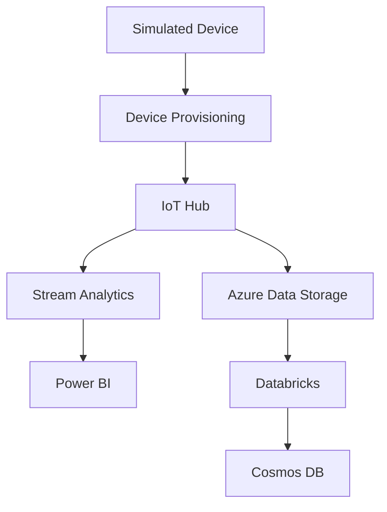

# 🚀 Azure IoT Flow 🌐

Welcome to the **Azure IoT** project! This repository is a simple entry level project that demonstrates an end-to-end flow, starting from **device provisioning** all the way to data visualization and real-time monitoring through Azure services like **IoT Hub**, **Stream Analytics**, **Power BI**, and more.


## 🔄 Data Flow

The data flow starts from the **simulated device**, where telemetry is sent to the **IoT Hub**. Depending on the data path:

1. **Hot Path**: Data is processed by **Stream Analytics** and output to **Power BI** for real-time visualization.
2. **Cold Path**: Data is stored in **Azure Storage**, processed by **Databricks**, and analyzed in **Cosmos DB** for advanced insights.



## 🌍 Overview

This project showcases how to securely connect IoT devices to the cloud using **Azure IoT** services. It captures data from devices, processes the data in real-time, and provides insightful visualizations for monitoring. The architecture supports both **hot path** and **cold path** analytics.

### 📊 Hot Path: 

Below Shows some realtime charts and graphs generated via the power BI platform
- Real-time data processed by **Stream Analytics** and displayed on **Power BI** dashboards.


### 🧊 Cold Path:
- Data stored in **Azure Data Storage**, processed in **Databricks**, and transformed for deeper insights using **Cosmos DB**.

## 🏛️ Architecture

```txt
Simulated Device → Device Provisioning → IoT Hub → Stream Analytics (hot path) → Power BI (real-time dashboard)
                                      ↘ Azure Data Storage (cold path) → Databricks → Cosmos DB (analysis and transformation)
```

## 🛠️ Key Components

| 🔧 Service            | 📋 Description                                                                         |
|-----------------------|----------------------------------------------------------------------------------------|
| **Azure IoT Hub**      | Manages and routes messages between IoT devices and the cloud.                         |
| **Device Provisioning**| Secures and authenticates IoT devices for communication.                              |
| **Stream Analytics**   | Processes data in real-time and pushes it to **Power BI** for live monitoring.        |
| **Azure Storage**      | Stores raw data for batch processing in **Databricks**.                               |
| **Databricks**         | Analyzes and transforms stored data for deeper insights.                              |
| **Cosmos DB**          | Stores processed data from **Databricks** for querying and analysis.                  |
| **Power BI**           | Provides real-time data dashboards for visualization.                                 |

## 🚀 Getting Started

To get started with this project, follow the steps below to set up your environment and deploy the necessary Azure services.

### 📝 Prerequisites

- Azure Subscription
- Basic knowledge of Azure IoT Services
- Azure CLI installed
- Node.js and npm installed (for simulated device)

### 🔧 Setup

1. **Clone the repository**:
   ```bash
   git clone https://github.com/moshdev2213/CloudyWires-IoT-Magic
   cd azure-iot-project
   ```

2. **Install dependencies for the simulated device**:
   ```bash
   cd device
   npm install
   ```

3. **Set up Azure services** (IoT Hub, Device Provisioning, Stream Analytics, etc.):
   - Create a **Resource Group** in Azure:
     ```bash
     az group create --name IoT-demo --location <your-location>
     ```
   - Create an **IoT Hub**:
     ```bash
     az iot hub create --resource-group IoT-demo --name IoTHubDemo --location <your-location> --sku S1
     ```

   - Create an **Stream Analytics Job**:
     ```bash
      az stream-analytics job create \
        --resource-group IoT-demo \
        --name MyStreamAnalyticsJob \
        --location <your-location> \
        --sku Standard
     ```
   - Create a **Stream Analytics Job**:
      ```bash
      az stream-analytics job create \
          --resource-group IoT-demo \
          --name MyStreamAnalyticsJob \
          --location <your-location> \
          --sku Standard
      ```

    - Create Add an **input** (IoT Hub) to the Stream Analytics job:
      ```bash
      az stream-analytics input create \
          --job-name MyStreamAnalyticsJob \
          --resource-group IoT-demo \
          --name IoTHubInput \
          --type IoTHub \
          --iot-hub IoTHubDemo \
          --shared-access-policy-name service \
          --shared-access-policy-key <your-iothub-key> \
          --consumer-group $Default
      ```

    - Create Add an **output** (Power BI) to the Stream Analytics job:
      ```bash
      az stream-analytics output create \
          --job-name MyStreamAnalyticsJob \
          --resource-group IoT-demo \
          --name PowerBIOutput \
          --power-bi-dataset Workspace \
          --power-bi-dataset-table IoTData \
          --authentication-mode UserToken
      ```

    - Create an **Azure Storage Account**:
      ```bash
      az storage account create \
          --name mystorageaccountname \
          --resource-group IoT-demo \
          --location <your-location> \
          --sku Standard_LRS
      ```

    - Create a **storage container**:
      ```bash
      az storage container create \
          --name iotdatacontainer \
          --account-name mystorageaccountname
      ```

    - Create an **Azure Databricks Workspace**:
      ```bash
      az databricks workspace create \
          --resource-group IoT-demo \
          --name MyDatabricksWorkspace \
          --location <your-location> \
          --sku standard
      ```

    - Get the **Databricks workspace URL**:
      ```bash
      az databricks workspace show \
          --name MyDatabricksWorkspace \
          --resource-group IoT-demo \
          --query "workspaceUrl" \
          --output tsv
      ```

    - Create a **Cosmos DB account**:
      ```bash
      az cosmosdb create \
          --name MyCosmosDBAccount \
          --resource-group IoT-demo \
          --location <your-location> \
          --kind GlobalDocumentDB \
          --default-consistency-level Eventual
      ```

    - Create a **database and container** in Cosmos DB:
      ```bash
      az cosmosdb sql database create \
          --account-name MyCosmosDBAccount \
          --resource-group IoT-demo \
          --name IoTDataDB
      ```

    - Create a **container** in the Cosmos DB database:
      ```bash
      az cosmosdb sql container create \
          --account-name MyCosmosDBAccount \
          --resource-group IoT-demo \
          --database-name IoTDataDB \
          --name IoTDataContainer \
          --partition-key-path "/deviceId"
      ```

---

By following these steps, you'll have set up the necessary Azure services for your IoT solution, ready for device provisioning, real-time data analytics, and data storage.

**Note**: -  use **Azure Portal** for more clarity.

### 📱 Provisioning Devices

- **Device Provisioning** is done using Azure IoT Hub’s **Device Provisioning Service (DPS)**. Once the device is registered, it can securely communicate with the IoT Hub.

  Example for provisioning a simulated device:
  ```bash
  az iot hub device-identity create --device-id MySimulatedDevice --hub-name IoTHubDemo
  ```

### 💡 Keywords
- Azure Storage
- Stream Analytics
- IoT Hub
- Cosmos DB
- Device Provisioning
- Databricks
- Power BI

## 🤝 Note

This Project is created in-order to grab the azure IoT workflows and intergrations, feedbacks are kindly accepted with thanks.